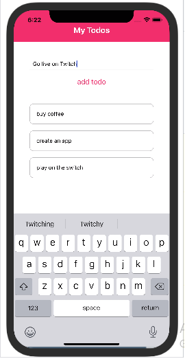
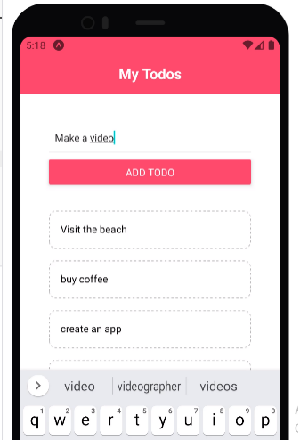

# react-dojo-blog
Mobile bank is a bank application coded in React. The database used is json-server. This application is used for normal banking purposes and has the following features:-

* Create account
* Create virtual cards
* Transfer
* Pay bills

## Screenshots

## How to install and run this project
1. clone the repo
2. run `npm install`
3. run `npm start` to start the development server